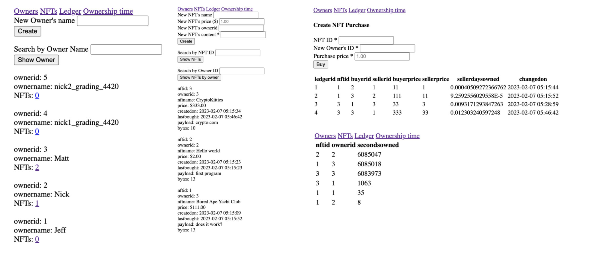

# CMPS 4420 Final Project Proposal
# *SQLite vs MongoDB Performance*
### **Jeff Hicks**  
### **Spring 2023**  

<br/>

## Overall Idea:
Taking our Lab 2 data on NFT’s which is written for SQLite, I will transfer the data to MongoDB, a NoSQL Database. After converting the tables, I will create a web-server application, like Lab 2, using PHP and MongoDB to display “Owners,” “NFTs,” “Ledgers,” and “Ownership Time.” I will do this on my own personal server to be able to download and run MongoDB working alongsisde PHP. I will test the performance between SQLite vs MongoDB commands and indexes to determine efficiency between different types of databases. I will also look at scalability between the two databases. Primarily focusing on vertical scaling, as I will increase the size of data. 

## Github: 
[Github | 4420 Final Project](https://github.com/jeffh1cks/4420)

## Previous Site: 


## Tables in SQLite
```sql
CREATE TABLE owner (
    ownerid integer primary key autoincrement,
    ownername text
);

CREATE TABLE nft (
    nftid integer primary key autoincrement,
    ownerid integer default null,
    nftname text,
    price numeric(14, 2) not null default 0.00,
    createdon text default CURRENT_TIMESTAMP,
    lastbought text default CURRENT_TIMESTAMP,
    payloadtype text default null,
    payloadfilename text default null,
    payload blob default null CHECK (length(payload) <= 1048576),
    foreign key (ownerid) references owner(ownerid) on update cascade on delete set null
);

CREATE TABLE ledger (
    ledgerid integer primary key autoincrement,
    nftid integer not null,
    buyerid integer not null,
    sellerid integer default null,
    buyerprice numeric(14, 2) not null default 0.00,
    sellerprice numeric(14, 2) not null default 0.00,
    sellerdaysowned real default 0.0,
    changedon text default CURRENT_TIMESTAMP
);

PRAGMA foreign_keys = ON;
```

## Motivation:
With most of our work in this course being with relational databases, SQLite and MariaDB, I wanted to compare/contrast it with a NoSQL database. I will take our current working database in SQLite for NFTs and convert to MongoDB. Once I have converted the database, I will run queries on the databases and compare times for execution. I will look at the effect on performance of adding secondary indexes for the different databases. I will also scale up my database to see the effect on each type of database. The purpose of this is to decide which database type best fits the data for our NFT data and how to best handle scaling. 
<br/>
<br/>
I will also get some practice hosting my web application and database on my own server. With Artemis, only allowing SQLite and MariaDB, there was a need to use my own server for which I will have more control in using MongoDB for my new database.  


## Background:
SQL, structured query language, is the primary language used for relational databases, which include a focus on not duplicating data. SQL is used to query and manage data. Data is stored in rows and columns and linked with foreign keys and joins. “These relational databases, which offer fast data storage and recovery, can handle great amounts of data and complex SQL queries” (IBM). 
<br/>
<br/>
NoSQL, is nonrelational database, with data not structured thus allowing the format to be flexible to the data. NoSQL refers to “not only SQL.”  Benefit of NoSQL is that it allows user to store and access data with little storage overhead. 
<br/>
<br/>

  
[Integrate.io](https://www.integrate.io/blog/the-sql-vs-nosql-difference/##:~:text=SQL%20databases%20are%20vertically%20scalable,data%20like%20documents%20or%20JSON.)


## Justification:
Practice in migrating from one database type to another. This will simulate a real-world environment where an employer wants to move their web application from a SQL database to NoSQL database. Depending how the employer wants to scale their application, the ability to migrate from one to another would be a useful task depending on storage limitations, whether to scale horizontally or vertically.   
After migrating, I will test and analyze performance differences between using the two different types of databases given our NFT data. Also analyze the effects on our database using both primary and secondary indexes and an increase in data to affect scalability. 

## Web Application on Personal Server: 
To be able to host this web application, I will host it on my own personal server. I will use a Ubuntu VM using DigitalOcean and Apache2 to serve the web-content with use of a proxy-pass. I will use my domain name given to my server from my CMPS 3680 course and create a route to 4420 where the web application will be hosted. I will validate my server by using “CertBot” to obtain SSL/TSL certification.
<br/>
<br/>
In creating **project proposal**, I linked my artemis public_html/4420/final folder to my own website from cmps3680 with a 301 redirect. I also, with the help of professor Paul Royer, researched and used Markdown, and Marked.js to dynamically create the page by fetching first the txt file and then using the "marked" cdn to generate the html. To generate the code snippet, I used Prism.js and prism.css to style the SQL code.  
<br/>
<br/>
For final project, I will create different tabs for which one can obtain the proposal, owners, nfts, ledgers, and the ownership time, along with a summary page.


## Technology Stack
**Front-End**: HTML, CSS used to display my web-application. PHP used to handle connection between server and database  
**Back-End**: MongoDB and SQLite for database   
**Server**: Ubuntu VM using DigitalOcean and PHP to connect server logic to database.  

## Resources:
[Lab 2 sqlite3 with PHP](https://csub.instructure.com/courses/24062/assignments/416531)  
[Integrate.io | The SQL VS NoSQL Difference](https://www.integrate.io/blog/the-sql-vs-nosql-difference/#:~:text=SQL%20databases%20are%20vertically%20scalable,data%20like%20documents%20or%20JSON.)  
[IBM | SQL vs NoSQL](https://www.ibm.com/cloud/blog/sql-vs-nosql)  
[MongoDB](https://www.mongodb.com/)  
[SQLite](https://www.sqlite.org/about.html)   
[DigitalOcean | Install Apache on Ubuntu 22.04](https://www.digitalocean.com/community/tutorials/how-to-install-the-apache-web-server-on-ubuntu-22-04#prerequisites)   
[CertBot](https://certbot.eff.org/instructions?ws=apache&os=ubuntufocal)


